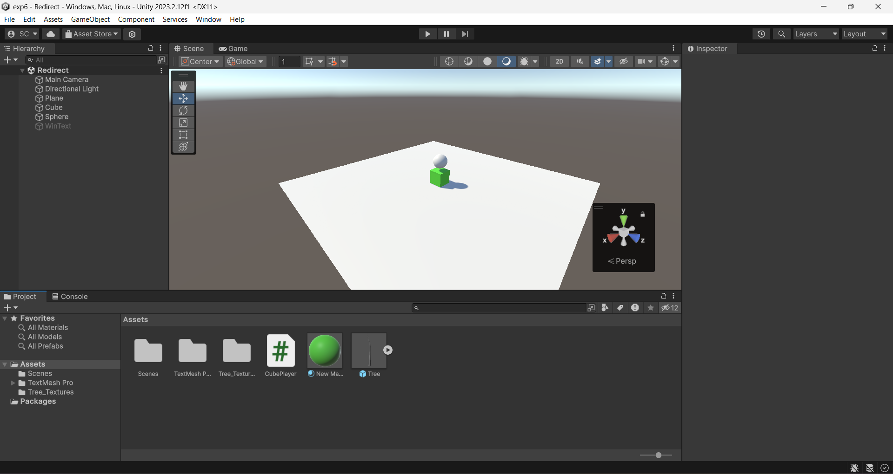
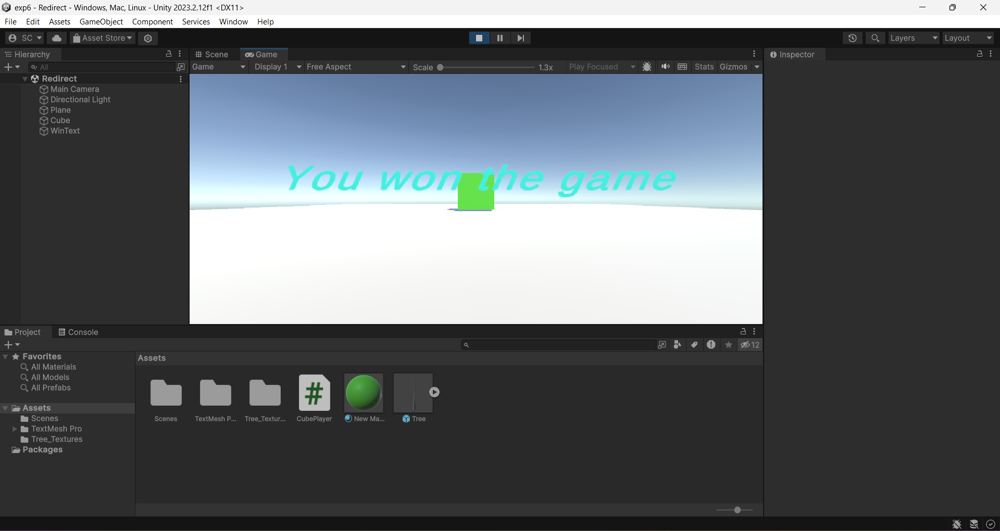
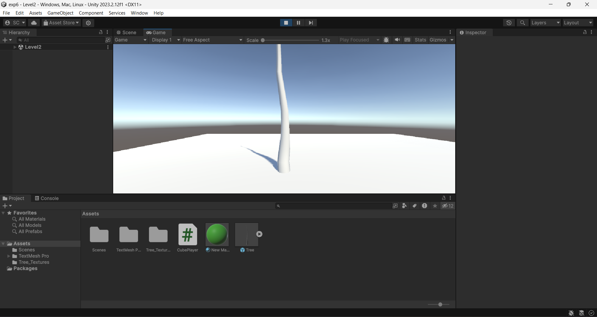

# Ex06-Redirecting-the-Scene

## Aim:
To create a project in unity and redirect the scene using C# script.

## Algorithm:

### Step 1:
Create a new C# script named "CubePlayer".

### Step 2: 
Inside the "CubePlayer" script, import necessary Unity libraries.
   (i.e.,using UnityEngine; and
   using UnityEngine.SceneManagement;)

### Step 3: 
Use 'SceneManager.LoadScene() method in the script to handle scene redirection.

### Step 4: 
Attach the "SceneRedirector" script to an empty GameObject in your scene.

### Step 5: 
Ensure proper setup of scene names for redirection.
   
### Step 6: 
Press the specified key (in this case, "R") to test redirection to the "Level2" scene.

## Program:
Developed By:SETHUKKARASI C<br>
Register Number:212223230201

CubePlayer:
```
using System.Collections;
using System.Collections.Generic;
using UnityEngine;
using UnityEngine.SceneManagement;

public class CubePlayer : MonoBehaviour
{
    Rigidbody rb;
    public GameObject WinText;
    // Start is called before the first frame update
    void Start()
    {
        rb = GetComponent<Rigidbody>();
    }

    // Update is called once per frame
    void Update()
    {
        if(Input.GetKeyDown(KeyCode.R))
        {
            SceneManager.LoadScene("Level2");
        }
    }
    private void OnCollisionEnter(Collision other)
    {
        if(other.gameObject.tag=="sphere")
        {
            Destroy(other.gameObject);
            WinText.SetActive(true);
        }
    }
}
```

## Output:




## Result:
Thus, the C# script is successfully created and it is verified that the scene is redirected in unity.